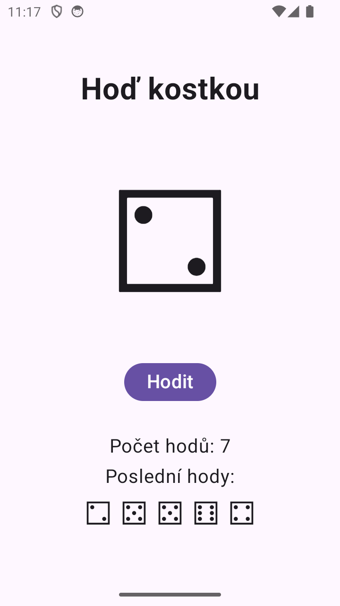

# Hoď kostkou - Jetpack Compose

Verze v Jetpack Compose (Empty Activity). XML verze je v [MyApp003Xml](../MyApp003Xml).

## Porovnání

V XML verzi je kostka TextView `tvDice`, který si najdu přes `findViewById`. Při hodu ho přepisuju přímo v kódu (`tvDice.text = ...`) a tlačítko vypínám přes `btnRoll.isEnabled`.

V Compose verzi nic hledat nemusím. Kostka je proměnná `dice` uložená jako stav (`mutableStateOf`). Při hodu měním jen tuhle proměnnou a Compose obrazovku překreslí sám. Tlačítko má `enabled = !isRolling`, takže se vypne samo, když běží hod.

Čekání 250 ms je v obou verzích přes korutinu a `delay()`, aby aplikace nezamrzla.

## Vylepšení

Přidal jsem počítadlo hodů a historii posledních 5 hodů. Po každém hodu se počet zvýší o 1 a výsledek se přidá na začátek historie, starší hody nad 5 se zahodí. Obojí jsou zase jen stavy (`rollCount`, `history`), takže se zobrazí samy.
