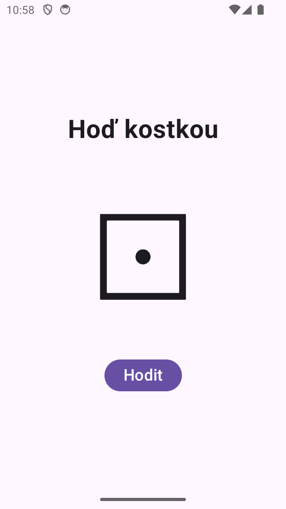

# Hoď kostkou — Jetpack Compose

Šablona Empty Activity, rozhraní definované v Kotlinu. Varianta v XML: [MyApp003Xml](../MyApp003Xml).

## Porovnání: jak se aktualizuje zobrazená kostka

| | XML + Kotlin (`MyApp003Xml`) | Jetpack Compose (`MyApp003Compose`) |
| --- | --- | --- |
| Rozhraní | `activity_main.xml` | funkce `DiceScreen()` v Kotlinu |
| Přístup ke kostce | `findViewById(R.id.tvDice)` | žádný, kostka je jen `Text(text = dice)` |
| Změna kostky | kód přímo přepíše `tvDice.text = …` | kód změní stav `dice`, Compose obrazovku sám překreslí |
| Zakázání tlačítka | `btnRoll.isEnabled = false` | `enabled = !isRolling` podle stavu |
| Prodleva 250 ms | korutina v `lifecycleScope` s `delay()` | korutina z `rememberCoroutineScope()` s `delay()` |

XML varianta je imperativní: kód říká, který prvek se má změnit a jak.
Compose je deklarativní: kód popisuje, jak obrazovka vypadá pro daný stav,
a při změně stavu se vykreslí znovu.
