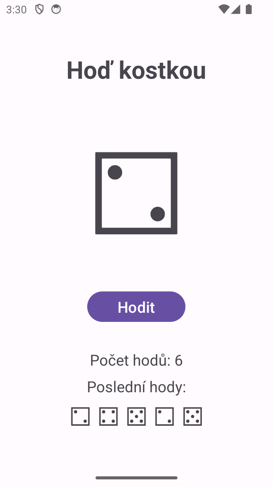

# Hoď kostkou - XML + Kotlin

Verze s XML layoutem (Empty Views Activity). Compose verze je v [MyApp003Compose](../MyApp003Compose).

## Porovnání

V XML verzi je kostka TextView `tvDice`, který si najdu přes `findViewById`. Při hodu ho přepisuju přímo v kódu (`tvDice.text = ...`) a tlačítko vypínám přes `btnRoll.isEnabled`.

V Compose verzi nic hledat nemusím. Kostka je proměnná `dice` uložená jako stav (`mutableStateOf`). Při hodu měním jen tuhle proměnnou a Compose obrazovku překreslí sám. Tlačítko má `enabled = !isRolling`, takže se vypne samo, když běží hod.

Čekání 250 ms je v obou verzích přes korutinu a `delay()`, aby aplikace nezamrzla.
